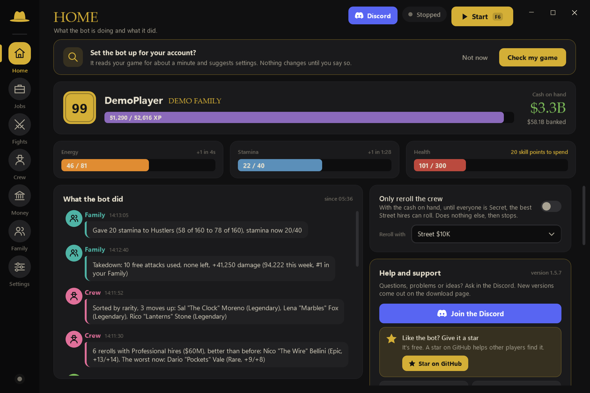
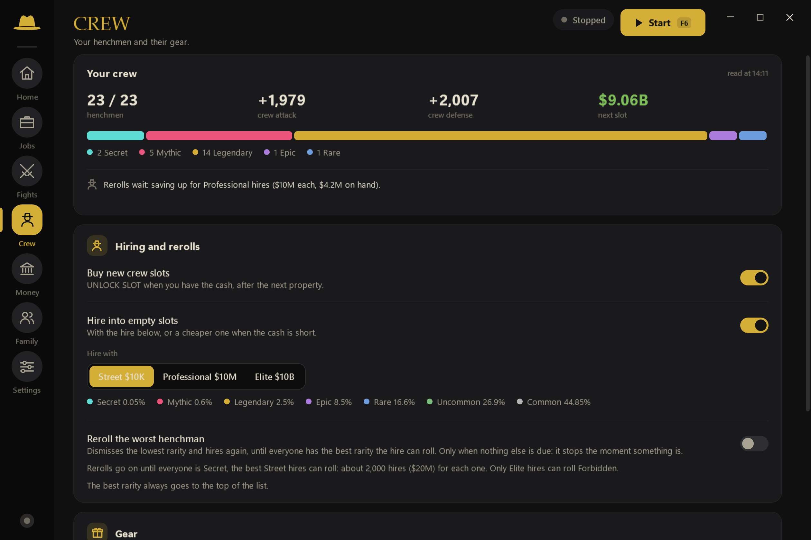
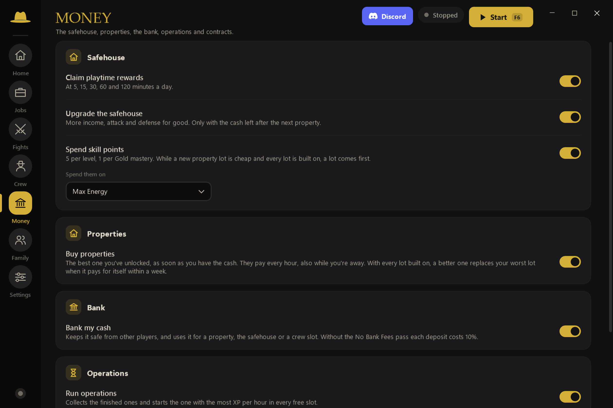

# Idle Mafia Bot

Plays the Roblox game **Idle Mafia Game** for you while you're away: jobs, properties, heists, bosses, the bank,
operations, daily rewards, the shop, crates, your crew, the safehouse and your family. Every part has its own switch.

 

It only reads the screen and moves the mouse, like someone at your PC, and only while you leave the PC alone. It never
changes Roblox, never goes online, never asks for your password and never presses anything that costs Robux (the full
list of buttons it never presses is on its Settings page).

## Download

1. Get the zip from [Releases](https://github.com/geenusername/IdleMafiaBot/releases/latest) and unzip it anywhere
   (not in Program Files).
2. Double-click `IdleMafiaBot.exe`. If Windows says "Windows protected your PC", press **More info**, then
   **Run anyway**.
3. Open Idle Mafia Game in Roblox, press **Check my game** for settings that suit your level, then **Start** (or F6).

You need Windows 10 or 11 with English text recognition (the bot tells you if it's missing). Any Roblox window size
works.

## Updates

Close the bot and replace `IdleMafiaBot.exe` with the one from the new zip. Your settings stay.

## Help

Ask in the [Discord](https://discord.gg/xw56YcDFyg). Found a bug? Press **Report a problem** in the bot and post the
zip it puts on your Desktop in the Discord or in an [issue](https://github.com/geenusername/IdleMafiaBot/issues). The
zip shows your Roblox name.
